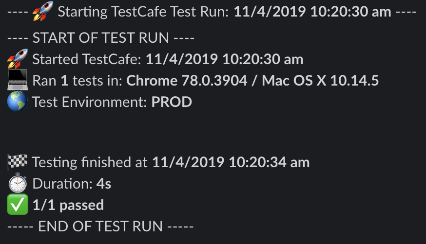
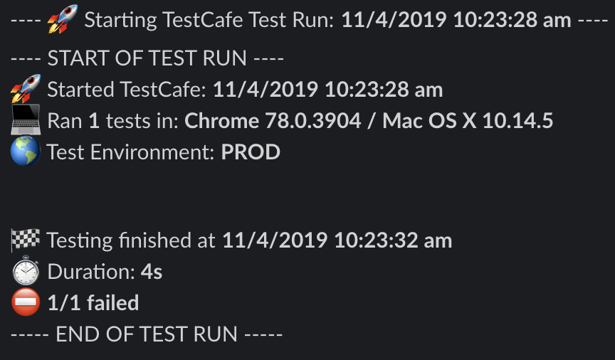

# TestCafe Reporter Slack Custom
### testcafe-reporter-slack-custom

This is a reporter for [TestCafe](http://devexpress.github.io/testcafe). It sends the output of the test to [Slack](https://slack.com/).

## Purpose
Once configured the reporter sends test results to Slack channel, e.g.





## Installation

Install this reporter as your test project dependency:

```bash
yarn add testcafe-reporter-slack-custom
```

## Setup instructions
In order to use this TestCafe reporter plugin, it is necessary to add it as your reporter to your TestCafe.

### Using `.testcaferc.json` config file

Add a reporter name (`slack-custom`) to your `reporter` object:

```json
{
  "browsers": [ "chrome" ],
  "src": "scenarios",
  "reporter": [
    {
      "name": "slack-custom"
    }
  ]
}
```

### Using TestCafe API

Pass the reporter name (`slack-custom`) to the `reporter()` method:

```js
testCafe
    .createRunner()
    .src('path/to/test/file.js')
    .browsers('chrome')
    .reporter('slack-custom') // <-
    .run();
```

### Necessary configuration

After that, you should define **.env** file with variables in your test project, hence the folder from where your call TestCafe (root directory).

```dotenv
# .env
TESTCAFE_SLACK_WEBHOOK=https://hooks.slack.com/services/*****
```

This is **required minimum to have the reporter working**.

## Options

Slack Custom reporter has few options which it could be configured from: `.scReporterConfig.js`, `.testcaferc.json`, or `.env` file as global variables.
**It will first retrieve the values from the `.scReporterConfig.js` file, followed by the TestCafe config file `.testcaferc.json`**, after that from `.env` file.

* :warning: - **required**

#### Slack Webhook URL :warning:

**This option is required!** Your Slack channel webhook URL generated from Slack API to allow reporter post there.
It's **not recommended** to pass your `webhookUrl` into either config file, in this case, due to sensitive data, it's **better to pass it via global variable** in `.env` file.

* via `.scReporterConfig.js`

```javascript
module.exports = {
  webhookUrl: "https://hooks.slack.com/services/*****"
};
```

* via `.testcaferc.json`

```json
{
  "name": "slack-custom",
  "options": {
    "webhookUrl": "https://hooks.slack.com/services/*****"
  }
}
```

* via `.env` file

```dotenv
# .env
TESTCAFE_SLACK_WEBHOOK=https://hooks.slack.com/services/*****
```

#### Logging level

Choose your report logging level, if you want to see each test with error stack trace, choose `DETAILED` (default). The second one is short & condensed which shows the only number of tests which passed, failed, and were skipped - `SUMMARY`.  If you would like a summary view, but to explicity show test errors, choose `SUMMARY_WITH_ERRORS`.

* via `.scReporterConfig.js`

```javascript
module.exports = {
  loggingLevel: "SUMMARY"
};
```

* via `.testcaferc.json`

```json
{
  "name": "slack-custom",
  "options": {
    "loggingLevel": "SUMMARY"
  }
}
```

* via `.env` file

```dotenv
# .env
TESTCAFE_SLACK_LOGGING_LEVEL=SUMMARY
```

#### Quiet mode

Choose if you want to have messages in the terminal about sending specific messages to Slack, it's turned off by default.


* via `.scReporterConfig.js`

```javascript
module.exports = {
  quietMode: true
};
```

* via `.testcaferc.json`

```json
{
  "name": "slack-custom",
  "options": {
    "quietMode": true
  }
}
```

* via `.env` file

```dotenv
# .env
TESTCAFE_SLACK_QUIET_MODE=true
```

#### Overriding Reporter Methods

TestCafe Reporters require certain reporting methods. You can read more about those here: [TestCafe Reporter Methods](https://devexpress.github.io/testcafe/documentation/extending-testcafe/reporter-plugin/reporter-methods.html). Slack Custom Reporter allows you to customize the output of these functions, to a certain degree.  **This can only be done via the `.scReporterConfig.js` file inside a reporterMethods object and must return a specific format in order to work properly.**

Your function must return either an object, or an array of objects, with an *action* key that may only have a value of *ADD* or *SEND* and a *message* key with a String value.

*ADD* - adds your message to a message list that will be sent to Slack at the end of the test run.
*SEND* - immediately sends the message to Slack.

* via `.scReporterConfig.js`

```javascript
module.exports = {
  reporterMethods: {
    reportTaskStart: function(startTime, userAgents, testCount) {
      return {
        action: 'ADD',
        message: 'The tests started at: ' + startTime
      };
    }
  }
};
```

Multiple messages can be passed through:

```javascript
module.exports = {
  reporterMethods: {
    reportTaskStart: function(startTime, userAgents, testCount) {
      return [
        {
          action: 'SEND',
          message: 'Starting Tests!'
        },
        {
          action: 'ADD',
          message: 'Test Count: ' + testCount
        }
      ];
    }
  }
};
```

## Further Documentation :books:
[TestCafe Reporter Plugins](https://devexpress.github.io/testcafe/documentation/extending-testcafe/reporter-plugin/)
